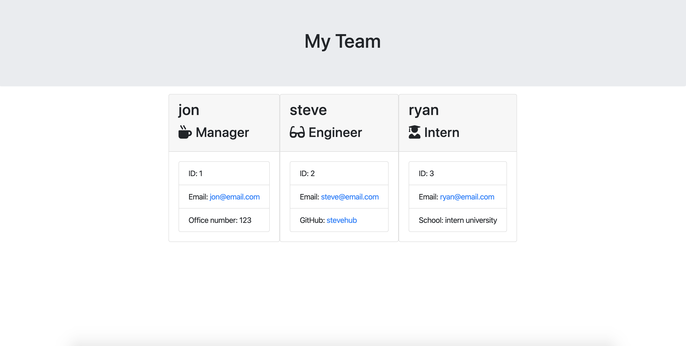

# Team Profile Generator
An OOP geared application using inquirer to gather information about a given team and output that data into a formatted html file ./output/team

## Example

## How to use it
* run npm install before launching the application
* open the directory in your command line terminal
* launch with "node app.js" or "npm start"

### User Story
* As a manager
* I want to generate a team profile
* So that I can have a neat representation of my colleagues